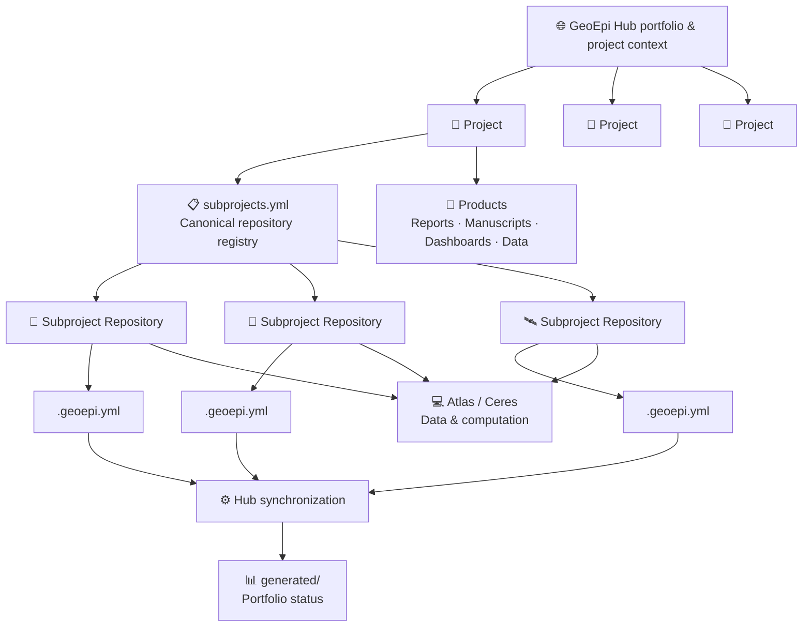

# GeoEpi Hub

[](https://github.com/geoepi/geoepi-hub/actions/workflows/update-hub.yml)

The **GeoEpi Hub** is the central project and data-management index for the
[GeoEpi Research Group](https://github.com/geoepi).

It provides a single place to understand:

- what projects GeoEpi is working on;
- who is responsible for them;
- which controlled or project-generated data they depend on;
- which analytical subprojects contribute to each project;
- where those subprojects are maintained;
- what major products and deliverables are being developed; and
- the current state of active analytical work.

The Hub is intentionally **not** an analysis repository or computational data
store. Scientific implementation belongs in individual subproject repositories,
while large data and computational execution generally occur on the appropriate
research computing infrastructure.

## How GeoEpi work is organized



A useful shorthand is:

> **The Hub describes the project.  
> The subproject repository describes the science.  
> The computational environment performs the work.**

## Projects

Each major GeoEpi project has an entry under:

```text
projects/
```

A project entry provides shared context such as:

```text
projects/
  project-id/
    README.md
    decisions.md
    data/
      data-management-plan.md
      controlled-data-inventory.csv
    subprojects.yml
    products.yml
```

Project entries are kept deliberately small. They document project-level
information without duplicating the detailed scientific or computational
records maintained by individual subprojects.

## Subprojects

A **subproject** is an independently understandable and executable analytical,
software, modeling, data-acquisition, genomic, dashboard, or related
workstream.

As a general rule:

> **One analytically coherent workstream = one repository.**

Each subproject has one **canonical working repository**. The project-level
`subprojects.yml` file records where that repository is located.

Each participating subproject repository contains a small `.geoepi.yml` file
that reports portfolio-level information such as:

- parent project;
- subproject identifier;
- title and summary;
- lead;
- status;
- current focus;
- computational environment; and
- next milestone.

Detailed instructions for organizing and documenting GeoEpi subprojects are
available in the **GeoEpi Lab Book**:

**[Projects and Subprojects →](https://geoepi.github.io/geoepi-notebook/organization/projects-and-subprojects.html)**

Additional repository guidance is available here:

**[Canonical Repositories →](https://geoepi.github.io/geoepi-notebook/organization/repositories.html)**

## Automated portfolio status

The Hub periodically reads `.geoepi.yml` from the canonical repositories
registered by each project.

```text
projects/*/subprojects.yml
            ↓
     canonical repositories
            ↓
        .geoepi.yml
            ↓
    validation + synchronization
            ↓
          generated/
```

The resulting files under:

```text
generated/
```

are created automatically by GitHub Actions and provide a current cross-project
view of GeoEpi subprojects.

**Do not manually edit generated files.**

The synchronization follows a simple rule:

> **Synchronize project state, not project content.**

Detailed code, model parameters, environments, run records, SLURM jobs,
analytical provenance, validation results, and scientific outputs remain with
the subproject rather than being copied into the Hub.

## Data stewardship

The Hub may document the existence, stewardship, access conditions, and
authoritative location of controlled or project-generated data.

It does **not** store controlled datasets simply because they are listed here.

Restricted data, agreements, sensitive information, credentials, and large
computational objects remain in their approved systems.

The guiding principle is:

> **As open as possible and as restricted as necessary.**

See the GeoEpi Lab Book for the group's
[Data Management guidance](https://geoepi.github.io/geoepi-notebook/data/).

## Repository roles

| Location | Primary role |
|---|---|
| **GeoEpi Hub** | Project context, stewardship, portfolio coordination |
| **Subproject repository** | Scientific implementation and reproducibility |
| **Atlas / Ceres** | Large data, controlled data where approved, and computation |
| **Generated Hub files** | Automated portfolio-level status |
| **Overleaf / OSF / repositories / dashboards** | Scientific products and dissemination |

## Current projects

Project entries are maintained under [`projects/`](projects/).

The generated portfolio summary is available under [`generated/`](generated/).

---

### GeoEpi resources

- [GeoEpi Lab Book](https://geoepi.github.io/geoepi-notebook/)
- [GeoEpi GitHub Organization](https://github.com/geoepi)
- [How GeoEpi Organizes Work](https://geoepi.github.io/geoepi-notebook/organization/)
- [Projects and Subprojects](https://geoepi.github.io/geoepi-notebook/organization/projects-and-subprojects.html)
